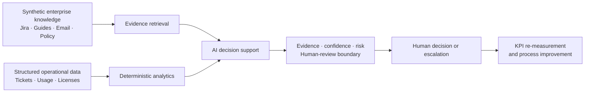

# AXPilot — Enterprise IT AX Operations

AI-powered decision support and operational intelligence platform for Enterprise IT.

AXPilot turns recurring IT support patterns and license-usage data into evidence-backed recommendations, while keeping account, security, and contract decisions with people.

## The operational problem

Enterprise IT teams can resolve individual requests without reducing the recurring issues behind them. This v0.7 PoC demonstrates three connected questions:

| Product surface | Operational question | Outcome |
| --- | --- | --- |
| **Operations Dashboard** | Where is support demand repeating? | Detect trends, repeat-contact signals, and improvement opportunities. |
| **Support Investigation** | What evidence supports a safe response to this request? | Classify an issue, retrieve sources, recommend reviewed actions, and escalate when needed. |
| **License Optimization** | What renewal quantity balances demand, cost, and operational risk? | Provide a deterministic recommendation for human review. |

## How AI is applied

AXPilot uses RAG to retrieve relevant enterprise knowledge from synthetic Jira incidents, knowledge guides, support emails, and policies. Retrieval supports evidence-grounded investigation; it does not replace structured analysis or human operational judgment.

- **Unstructured sources** — synthetic Jira incidents, knowledge guides, support emails, and policies are retrieved as evidence.
- **Structured sources** — ticket counts, repeat-contact rates, license utilization, quantities, and savings are calculated in deterministic TypeScript from synthetic Supabase data.
- **Human decisions** — privileged account changes, security-sensitive actions, license removal, and contract changes remain outside the application.

## Demo scenarios

### Support Investigation

**Request:** “I reset my password and cannot access VDI.”

AXPilot retrieves the relevant Jira incident, troubleshooting guide, support email, and IAM policy. It returns an issue classification, provisional likely cause, reviewed troubleshooting actions, confidence, escalation recommendation, and source cards.

The same evidence-first workflow also supports a Groupware workspace-access issue after a department transfer. Unsupported subjects, such as secure-printer contract renewal, abstain and route to human triage.

### License Decision Support

For the synthetic Enterprise Collaboration Suite, the recommendation accounts for 90-day active users, reserved seats, upcoming demand, a defined operational buffer, and contract minimums. The result is **380 renewal seats** and **$17,280 potential annual gross saving**.

Approve and Reject only record a local demo review state. They do not change a license, contract, or vendor system.

## AI and human responsibility

| Activity | Ownership |
| --- | --- |
| Classify requests, retrieve evidence, draft recommendations | AI-assisted and evidence-grounded |
| Verify account lock or synchronization status | IT Support, read-only |
| Unlock accounts or change privileges | Authorized administrator outside AXPilot |
| Calculate renewal quantity and potential savings | Deterministic decision support |
| Approve contract or license changes | Human decision and external execution |

## Decision architecture



## Operational KPI and governance

The Dashboard measures synthetic support volume, VDI authentication demand, password-reset-related contacts, repeat-contact rate, and AI-assist usage for explicit time windows. A VDI communication and FAQ improvement target is proposed; no improvement is claimed until a comparable follow-up cohort is measured.

License savings are potential gross savings, not realized savings. The application has no live Jira, Confluence, Active Directory, vendor, contract, or license-management integration. It never executes privileged actions.

## Run locally

Use Node 24 or newer.

```sh
npm ci
cp .env.example .env.local
```

Set `OPENAI_API_KEY`, `SUPABASE_URL`, and `SUPABASE_SERVICE_ROLE_KEY` in `.env.local`. Run the SQL files in [`supabase/migrations/`](supabase/migrations) in timestamp order, then seed the synthetic demo data:

```sh
npm run seed:documents
npm run seed:tickets
npm run seed:licenses
npm run dev
```

`seed:documents` and `test:live` make OpenAI API calls when run with your own API key. Validate the implementation with `npm run typecheck`, `npm test`, and `npm run test:ui`.

## Documentation

- [Architecture](docs/architecture.md)
- [AX framework](docs/ax-framework.md)
- [Synthetic dataset provenance](docs/synthetic-data.md)

## Synthetic data disclaimer

All enterprise data used in this project is fully synthetic and created solely for demonstration purposes. No proprietary or confidential information from any employer is included.

Example Manufacturing is a fictional company. Its source documents, policies, people, dates, usage records, and costs were created only for this demonstration.
