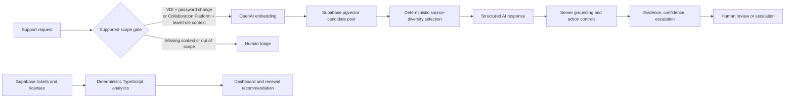

# Architecture — v0.7

AXPilot is a bounded Enterprise IT operations decision-support PoC. It supports investigation, operational analysis, and license-renewal review. It does not connect to live enterprise systems or execute an account, access, contract, or license change.

## Request flow

## Key decisions

1. **Bound the supported requests before retrieval.** v0.7 accepts VDI authentication after a password change and Collaboration Platform workspace access after a team or role transfer. A request without the required system-and-change context is returned as insufficient evidence for human triage without calling retrieval or the response model. The gate is a scope control, not an issue diagnosis.
2. **Separate unstructured evidence from structured facts.** `enterprise_documents` stores synthetic Jira incidents, Confluence guides, support emails, and policies. `support_tickets` and `licenses` store synthetic operational inputs. Deterministic TypeScript calculates all counts, rates, quantities, and savings after validated Supabase reads.
3. **Keep the vector space stable.** The seed and query path use `text-embedding-3-small` at 1,536 dimensions. SQL constrains model and dimension, and retrieval filters by dataset version. Changing either requires a coordinated migration and full re-embedding.
4. **Use a bounded candidate pool with source diversity.** Retrieval fetches eight vector candidates, rejects the request when the best candidate is below the `0.35` relevance gate, then retains up to four documents from the leading system/category. One troubleshooting guide and one governance policy are retained when available; this prevents symptom-heavy incidents and emails from displacing action boundaries. The returned order preserves vector similarity rank.
5. **Ground actions in reviewed metadata.** Incidents and emails may support a hypothesis but carry no authority. Only a guide or policy can allow an action through `metadata.allowed_actions`. The server validates selected source IDs and materializes reviewed action text; it never exposes executable privileged actions.
6. **Treat causes and confidence as provisional.** A historical incident is not a diagnosis of the current account. Confidence is an uncalibrated evidence-adequacy estimate with server-side caps, not a vector score, accuracy rate, or probability of resolution.
7. **Keep external clients server-only.** OpenAI and the Supabase service role stay on the server. Environment validation is lazy so builds and offline tests do not need credentials. The service role must never be exposed through a browser bundle.
8. **Trace a request without overstating audit capability.** Responses include source identities, model names, retrieval parameters, dataset version, timing, and a request ID. This is diagnostic trace data, not a persistent authenticated audit or approval trail.

## Evaluation and verification

`retrieval-eval-v1` contains 28 synthetic cases: 18 supported paraphrases across VDI and Collaboration Platform, including Korean and Japanese requests; four privileged or source-fabrication contexts; four out-of-scope requests; and two ambiguous requests. It records source ID, type, similarity rank, and required guide/policy recall.

The evaluation is a regression set, not a model-accuracy benchmark. Ambiguous requests are allowed to be informative to retrieval evaluation but must stop at the application scope gate in the live workflow. `npm run test:live` verifies grounded VDI and Collaboration Platform responses, Japanese retrieval and guardrails, out-of-scope abstention, ambiguous-request abstention, and privileged-request escalation. Saved paid-run output stays in ignored `outputs/` files without secrets.

## v0.7 limits and extension gate

- Eight short synthetic documents are stored as one document per chunk. There is no chunking, hybrid search, ANN index, or live Jira/Confluence/AD integration.
- Dashboard and Optimization read synthetic Supabase rows. The UI does not represent a production reporting cadence, adoption rate, or realized saving.
- Review controls record only local demo state. Human approval and external execution happen outside AXPilot.

Future work should add a use case only after it has a clear scope boundary, reviewed evidence sources, structured data owner, safe action catalog, evaluation cases, and a measurable follow-up KPI.
