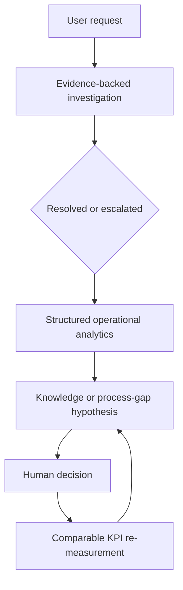

# AX operating hypothesis

The operating problem is not simply answering tickets faster. It is reducing recurring support demand and making cost decisions explainable while preserving human authority over sensitive changes.

## v0.7 operating model

| Surface | Operational question | AI or deterministic role | Human ownership |
| --- | --- | --- | --- |
| Support Investigation | What evidence supports a safe next step? | Retrieve evidence, draft a structured recommendation, expose uncertainty and escalation | Verify live state; authorize any account or access change |
| Operations Dashboard | Which request patterns may indicate a knowledge or process gap? | Calculate volumes, trends, repeat-contact rates, and proposed improvement targets | Approve communications, process changes, and follow-up measurement |
| License Optimization | What renewal quantity balances use, demand, constraints, and cost? | Deterministically calculate a recommendation and potential gross saving | Review, approve, negotiate, and execute any contract change |

## Current operational hypotheses

**VDI authentication after password reset.** The current synthetic 30-day cohort has 87 VDI authentication tickets, 39 password-reset-related tickets, and a 24.1% repeat-contact rate. The proposed intervention is clearer password-reset communication, reconnect instructions, and a revised FAQ. The proposed KPI is a 30% reduction in repeat VDI authentication inquiries after a comparable 30-day follow-up. No reduction has been measured.

**Groupware workspace access after transfer.** The current synthetic Groupware Access cohort has 58 tickets and a 20.7% repeat-contact rate. This cohort is not tagged to department transfers, so transfer checklist and role-synchronization communication are hypotheses, not observed causes. The next measurement must isolate transfer-related cases before assessing the proposed 20% reduction target.

**Collaboration-license renewal.** The Enterprise Collaboration Suite recommendation uses 302 90-day active users, 23 reserved seats, 35 upcoming-demand seats, a defined buffer, and a contract minimum. It recommends 380 renewal seats and $17,280 potential annual gross saving. The saving is neither approved nor realized.

## Evaluation before scale-up

The project evaluates the whole workflow rather than treating fluent generated text as success.

- **Retrieval:** `retrieval-eval-v1` checks required guide and policy recall for 24 versioned synthetic questions and records source IDs, types, ranks, and similarities.
- **Generation and grounding:** the server rejects fabricated source IDs and quotes, derives action citations from reviewed source metadata, and withholds actions when required guide or policy evidence is absent.
- **Scope and governance:** unsupported and ambiguous requests abstain to human triage; privileged account or workspace change requests escalate without execution.
- **Operations:** a target remains proposed until the same cohort is remeasured after a human-approved intervention.
- **Economics and adoption:** potential gross saving must be separated from approved and realized saving. Adoption, override, user-satisfaction, and operating-cost metrics require future measurement; none are fabricated in this PoC.

The current evaluation set is a regression control for two synthetic scenarios. It is not a general accuracy percentage, a claim of production reliability, or evidence that either intervention has reduced operational load.

## Scale-up gate

Before adding a new workflow such as provisioning, printer rollout, image upgrade, or vendor management, define the supported decision, authoritative evidence, structured data owner, safe action boundary, escalation owner, evaluation cases, and measurable follow-up KPI. This prevents feature expansion from becoming an ungoverned collection of AI demos.
